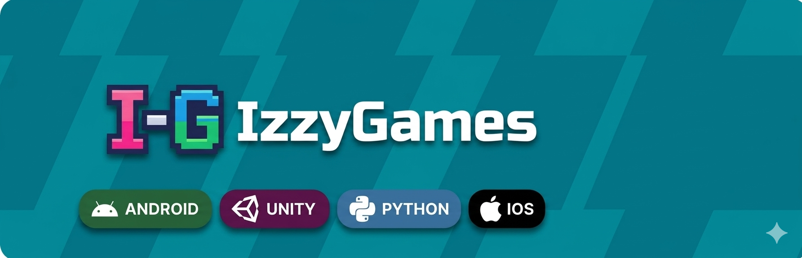

  <table width="100%" border="0" cellspacing="0" cellpadding="0">
    <tr>
      <td width="15%" align="center">
        
      </td>
      <td width="85%" align="left" style="padding-left: 20px;">
        <h1>👋 ¡Hola! Soy Isabela Téllez Poved</h1>
        
<b>Estudiante de Ingeniería Informática | Apasionada del Entorno 3D & Videojuegos 🎮</b> 
        Actualmente expandiendo mis habilidades técnicas construyendo aplicaciones, entornos interactivos y proyectos multimedia con impacto real y creativo.

      </td>
    </tr>
  </table>

  

---

## 👩‍💻 Sobre mí
* **🌱 Formación:**
  * Grado en **Ingeniería Informática** en la Universidad Internacional de La Rioja (UNIR)
  * Bootcamp en **Inteligencia Artificial y Python** en Somos F5 (1250h).
* **📚 Cursos & Especializaciones:**
  * Curso de Programación Python & Preparación AWS Cloud Practitioner | UNIR (2024 - 2025).
  * Máster en Programación de Videojuegos con Unity, Realidad Virtual (VR) y Aumentada (AR) (2024).
  * FP Grado Superior en Animación 3D, Juegos y Entornos Interactivos | Fundación Obicex (2022 - 2024).
* **🌍 Idiomas:** Castellano (Nativo) | Inglés (B2).
* **🎯 Mi meta:** Fusionar la ingeniería de software con el desarrollo multimedia y de videojuegos.

---

## 🛠️ Tech Stack & Herramientas

### 💬 Lenguajes

  
  
  
  

### ⚙️ Backend & Desarrollo Web

  
  

### 📊 Data Science & Análisis de Datos

  
  
  
  

### 🔒 Herramientas, Datos & Seguridad

  
  

---

## Featured Projects
<table width="100%">
  <tr>
    <td width="50%" valign="top">
      <h3>🦊 Looking-For-You </h3>
      
Un juego de plataformas 2D con 3 mundos y 5 niveles cada uno, con dificultad progresiva y enemigos que desafiarán la supervivencia.

    </td>
    <td width="50%" valign="top">
      <h3>🏙️ Climapp / UrbanNexus</h3>
      
Desarrollo y colaboración en plataformas de optimización y monitorización climática urbana, aportando datos estratégicos para Smart Cities y protocolos de emergencia.

    </td>
  </tr>
  <tr>
    <td width="50%" valign="top">
      <h3>📊 Pearson's Four</h3>
      
Proyecto enfocado en el procesamiento y análisis exploratorio de datos (EDA) a gran escala, orientado a extraer insights estratégicos del mercado laboral y tecnológico.

    </td>
    <td width="50%" valign="top">
      <h3>⚽ GoalMetrics</h3>
      
Dashboard interactivo que explora la historia y evolución del fútbol internacional.

    </td>
  </tr>
</table>

---
<table width="100%">
  <tr>
	<td width="50%" valign="top" style="border: 1px solid #30363d; border-radius: 6px; padding: 15px; background-color: #0d1117;">
      <h3>☎️ Contact Me & Digital Space</h3>
      

        
        
      

	</td>
	  <td width="50%" valign="top" style="border: 1px solid #30363d; border-radius: 6px; padding: 15px; background-color: #0d1117;">
       
      <blockquote align="left" style="margin: 0; padding-left: 10px; border-left: 3px solid #7aa2f7;">
        <i>"El código limpio siempre parece que ha sido escrito por alguien a quien le importa."</i>
      </blockquote>
    </td>
  </tr>
</table>
